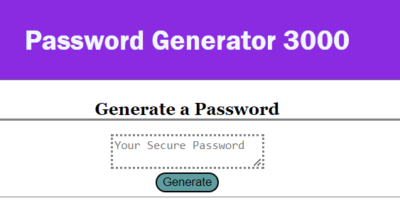
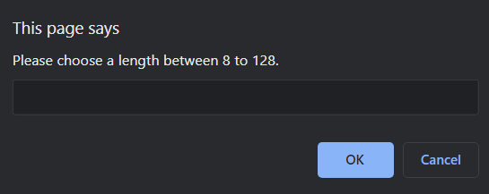
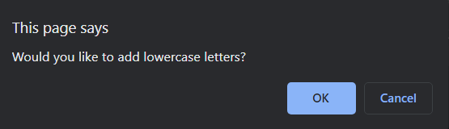
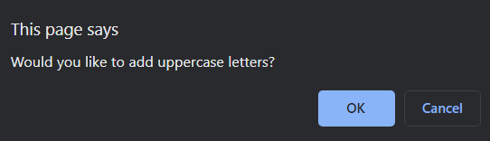
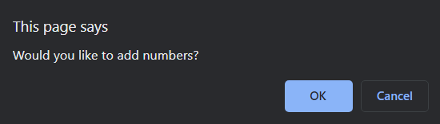

Password Generator

Description:

    An application made for everyday use. Can create a password within the specifications made by the user.

Uses:

    Assists in creating a strong randomized password
    Gives the user the choice in what is in the password

Screenshot of Page

Link: https://vtsander.github.io/PasswordGen/